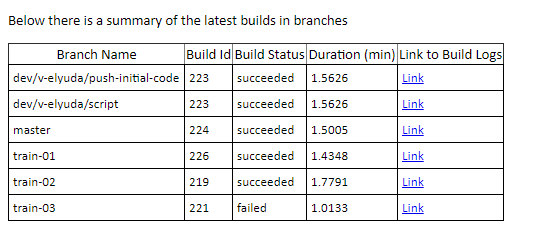

# Introduction 
This is a script to receive and build configured branches for an Android app from App Center.

# Getting Started
1.	Download the script to your local box. It's supposed to run in ps console or ps ISE (mode doesn't matter).
2.	To run the script you need an App Center Api token, an app name and its owner name, these three are required parameters (read more https://docs.microsoft.com/en-us/appcenter/api-docs/).
    - Token ($token) is a secured parameter while owner ($owner) and appName ($appName) are hard coded as default ones.
    
# Build and Test

1.	Command example for ps console (do not use in your ps session):  
    ```
    .\devTestTask.ps1 -token 14545fd4gdfgdg24dgf48d25fgddg.   
    ```
2. If there are 2 queued builds but you need to build one more branch then you'll be asked to wait for 10 sec and then contunie (type "y" or "n"):
    ```
    Would you like to wait [y/n]?: y
    ```
3. After the script completes then an html report will be opened in your browser session.

